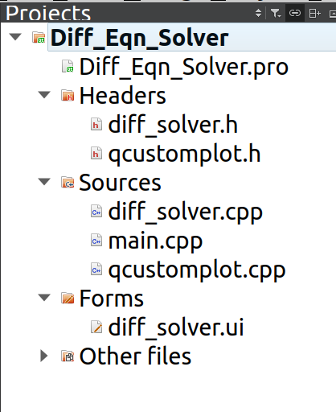
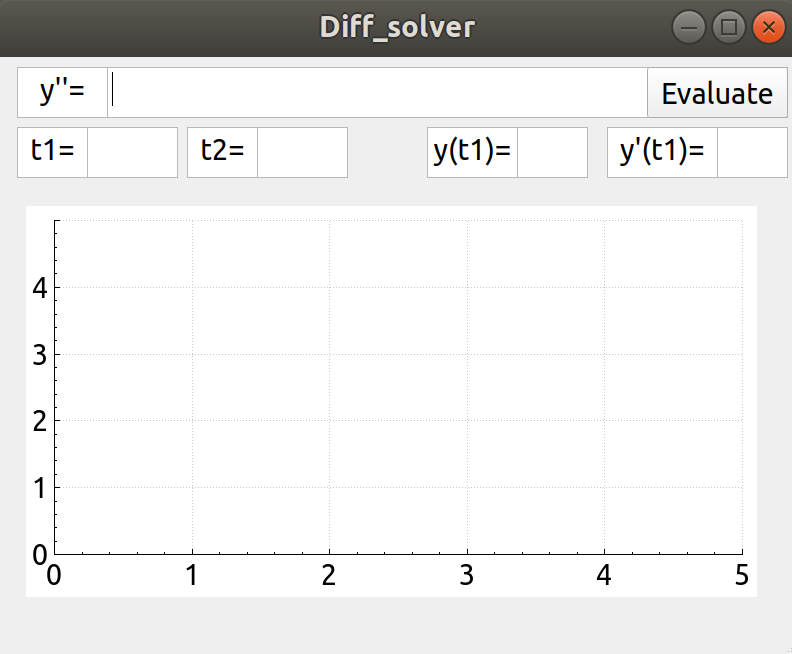
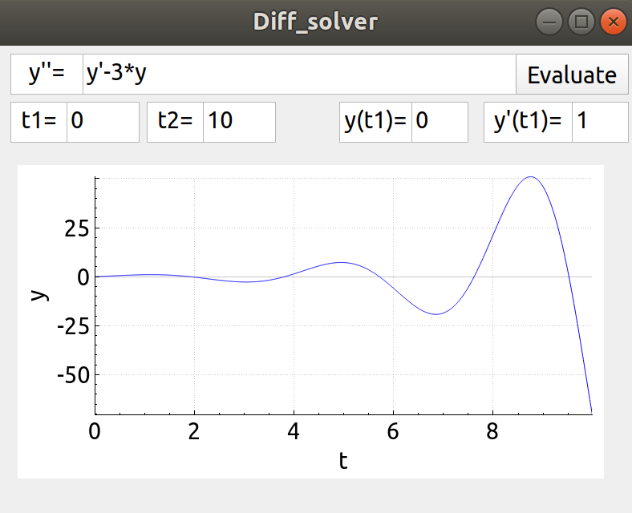

# GUI Differential Equation Solver on Qt

This is a GUI based Differential Solver made on [Qt](https://www.qt.io/ "Qt website") (pronounced "cute"). 
I learnt to use Qt [here](https://www.youtube.com/watch?v=txGRU7OrTZo "Qt tutorial to make calculator"). 

It solves second order differential equations of the form y''=f(y',y,t), given a start and end time, and initial conditions on y and y'. 
The algorithm used to solve the differential equation is the [Euler method](https://en.wikipedia.org/wiki/Euler_method), which is only a first-order method. 
Improvements can be made to this without too much difficulty
to increase the order (and accuracy).

To use this GUI, simply [install Qt](https://doc.qt.io/qt-5/gettingstarted.html "Getting started  with Qt"), create a new project and add the files from this folder into your project.
It should look something like this:  

On runnning the project, you will get this window:  

Now all you have to do is to enter the expression for y'' (write the expression just as you would enter in a calculator; remember to write
2*y instead of 2y, and so on), the time range, and the initial values of y and y'. Click on the Evaluate button and wait for a few seconds. 
The plot of y versus t will be displayed.
  
Here is an example: For the equation y''=y'-3y, with t from 0 to 10, and initial conditions y(0)=0, y'(0)=1:   

 
In case the layout of the window doesn;t suit your fancy, you can change the positioning of the text boxes, plot and button either in the code in 
<a href="diff_solver.ui">diff_solver.ui</a>,
or directly, in a much easier way, through the GUI preview that can be seen on clicking diff_solver.ui in the left pane in Qt.  
